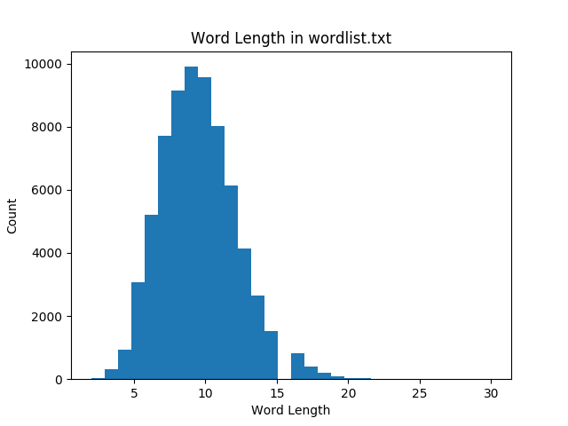

text: Lato, #000000
text-strong: Lato Bold, #000000
text-emphasis: Lato Light Italic
<!-- Use Courier theme -->

# [fit]Intro to Python 🐍

---

# Objectives

- Learn Python's syntax.
- Code a game of Hangman.

---

# About me


## Andrew Yang
## CS @ Illinois 2018

---

# Before we start...

- Install Python 3.6
- Download the zip file: **http://bit.ly/2GPZmAf**

---

# Go through Python tutorial on TutorialsPoint

---

# [fit]Basic Concepts

---

# Documentation

It is good practice to document code that you write.

```python
"""Here is the documentation for the module."""

def my_add_func(a, b):
    """Add two numbers together."""
    return a + b

def get_random_number():
    """Get a random number chosen by a dice roll. Guaranteed to be random.

    Source: https://xkcd.com/221/
    """
    return 4
```

---

# Lists vs. sets

- Both lists and sets can contain an arbitrary number of elements.
- The elements in a list are ordered, and a list can have duplicate elements.
- The elements in a set are **not** ordered, and a set **cannot** have duplicate elements.

---

```python
my_list = []
my_set = set()

my_list.append('a')
my_set.add('a')
print(my_list)  # Output: ['a']
print(my_set)  # Output: {'a'}

my_list.append('b')
my_set.add('b')
print(my_list)  # Output: ['a', 'b']
print(my_set)  # Output: {'b', 'a'}

my_list.append('a')
my_set.add('a')
print(my_list)  # Output: ['a', 'b', 'a']
print(my_set)  # Output: {'b', 'a'}
```

---

# Why use sets?

Suppose I have a collection of one billion unique strings. I want to determine whether the string `"UIUC"` is in that collection.

- **List**: Python has to search through the entire list and compare `"UIUC"` with each string.
- **Set**: Python can *hash* each string. Comparing hashes is **much quicker** than comparing strings.

---

# List comprehension

Concise syntax for creating lists from existing lists.

```python
# Goal: Add one to each number
my_list = [1, 3, 3, 7]

# Using for loop
my_list_plus_one = []
for num in my_list:
    my_list_plus_one.append(num + 1)
print(my_list_plus_one)  # Output: [2, 4, 4, 8]

# Raises TypeError: can only concatenate list (not "int") to list
my_list_plus_one = my_list + 1

# Using list comprehension
my_list_plus_one = [num + 1 for num in my_list]
print(my_list_plus_one)  # Output: [2, 4, 4, 8]
```

---

```python
my_list = [1, 3, 3, 7]

# Add one to each number
my_list_plus_one = [num + 1 for num in my_list]
print(my_list_plus_one)  # Output: [2, 4, 4, 8]

# Filter out numbers below 5, then add 1 to remaining numbers
filtered_out_low_nums = [num + 1 for num in my_list if num >= 5]
print(filtered_out_low_nums)  # Output: [8]

# For each number
# If number ≥ 5, set it to 5
# Otherwise, add 1 to the number
all_high_nums = [num + 1 if num >= 5 else 5 for num in my_list]
print(all_high_nums)  # Output: [5, 5, 5, 8]
```

---

# The `enumerate` function

When iterating through a list, you can keep track of both the index and element.

```python
words = ['all', 'your', 'base']
for idx, word in enumerate(words):
    print(idx, word)
print(list(enumerate(words)))

# Output:
# 0 all
# 1 your
# 2 base
# [(0, 'all'), (1, 'your'), (2, 'base')]
```

---

# [fit]Before we begin...
## [fit]What should a game of Hangman have?

---

# [fit]Part 1 of 5
## Selecting a word
## uniformly at random

---

# words.py

Check to see that you have the `wordlist.txt` file. Create a file called `words.py`

```python
"""Function to fetch words."""

import random

WORDLIST = 'wordlist.txt'

def get_random_word(min_word_length):
    """Get a random word from the wordlist using no extra memory."""
    pass
```

---

# Implement `get_random_word`

Simple approach: Gather all of the words into a list, and do `random.choice` to select a word uniformly at random.

```python
def get_random_word(min_word_length):
    """Get a random word from the wordlist using no extra memory."""
    words = []
    with open(WORDLIST, 'r') as f:
        for word in f:
            if '(' or ')' in word:
                continue  # Skip the word because it contains parentheses.
            word = word.strip().lower()
            if len(word) < min_word_length:
                continue  # Skip the word because it is too short.
            words.append(word)
    return random.choice(words)
```

---

# [fit]Part 2 of 5
# Game difficulty

---

# hangman.py

We'll need the two imports later.

```python
"""Main hangman game.

Use Python 3.
"""

from string import ascii_lowercase
from words import get_random_word
```

---

# [fit]How can we adjust game difficulty?

1. By specifying the number of incorrect attempts he/she is allowed. The less attempts there are, the harder the difficulty. Cannot be more than 25 incorrect attempts.
2. By specifying the minimum word length. The longer the minimum word length is, the harder the difficulty. We'll set minimum word length bounds to 4 and 16.

---



---

# Implement `get_num_attempts`

```python
def get_num_attempts():
    """Get user-inputted number of incorrect attempts for the game."""
    while True:
        num_attempts = input(
            'How many incorrect attempts do you want? [1-25] ')
        try:
            num_attempts = int(num_attempts)
            if 1 <= num_attempts <= 25:
                return num_attempts
            else:
                print('{0} is not between 1 and 25'.format(num_attempts))
        except ValueError:
            print('{0} is not an integer between 1 and 25'.format(
                num_attempts))
```

---

# Implement `get_min_word_length`

```python
def get_min_word_length():
    """Get user-inputted minimum word length for the game."""
    while True:
        min_word_length = input(
            'What minimum word length do you want? [4-16] ')
        try:
            min_word_length = int(min_word_length)
            if 4 <= min_word_length <= 16:
                return min_word_length
            else:
                print('{0} is not between 4 and 16'.format(min_word_length))
        except ValueError:
            print('{0} is not an integer between 4 and 16'.format(
                min_word_length))
```

---

# A note about infinite loops

Usually, coding an infinite loop (`while True`) is bad practice.

But we can make an exception because we have a clear and straightforward way of `break`ing out of the loop.

---

# [fit]Part 3 of 5
## [fit]Displaying the word

---

# Problem

- The displayed word has to be censored to avoid spoilers.
- We shouldn't modify the chosen word.
- We shouldn't needlessly copy the word just to censor some letters. Remember that strings are immutable.

```python
my_string = 'ABC124'

# Raises TypeError: 'str' object does not support item assignment
my_string[5] = '3'
```

---

# Solution

- Represent censored letters as a list of booleans.
- `True`: corresponding letter should be displayed
- `False`: corresponding letter should be censored and replaced with an asterisk

If the word is `"hangman"` and the boolean list is
`[False, True, True, False, True, True, True]`
We should display `*an*man`

---

# Implement `get_display_word`

```python
def get_display_word(word, idxs):
    """Get the word suitable for display."""
    if len(word) != len(idxs):
        raise ValueError('Word length and indices length are not the same')
    displayed_word = ''.join(
        [letter if idxs[i] else '*' for i, letter in enumerate(word)])
    return displayed_word.strip()
```

---

# [fit]Part 4 of 5
## Asking the player to
## input the next letter

---

On each turn, the player inputs a string.

# [fit]Which conditions must
# [fit]this input satisfy?

---

# Conditions

1. The input string must consist of a single character.
2. The input letter must be an ASCII lowercase or uppercase character. We can ensure the letter is lowercase by using `str.lower`
3. The input letter cannot have been guessed before.

---

# Implement `get_next_letter`

```python
def get_next_letter(remaining_letters):
    """Get the user-inputted next letter."""
    if len(remaining_letters) == 0:
        raise ValueError('There are no remaining letters')
    while True:
        next_letter = input('Choose the next letter: ').lower()
        if len(next_letter) != 1:
            print('{0} is not a single character'.format(next_letter))
        elif next_letter not in ascii_lowercase:
            print('{0} is not a letter'.format(next_letter))
        elif next_letter not in remaining_letters:
            print('{0} has been guessed before'.format(next_letter))
        else:
            remaining_letters.remove(next_letter)
            return next_letter
```

---

# [fit]Part 5 of 5
## [fit]Stitching it all together

---

# Implement `play_hangman`

```python
def play_hangman():
    """Play a game of hangman.

    At the end of the game, returns if the player wants to retry.
    """
    # Let player specify difficulty
    print('Starting a game of Hangman...')
    attempts_remaining = get_num_attempts()
    min_word_length = get_min_word_length()

    # Randomly select a word
    print('Selecting a word...')
    word = get_random_word(min_word_length)
    print()
```

---

# Initialize game state variables

Continue coding in `play_hangman`...

```python
idxs = [letter not in ascii_lowercase for letter in word]
remaining_letters = set(ascii_lowercase)
wrong_letters = []
word_solved = False
```

---

# Main game loop

Continue coding in `play_hangman`...

---

```python
while attempts_remaining > 0 and not word_solved:
    # Print current game state
    print('Word: {0}'.format(get_display_word(word, idxs)))
    print('Attempts Remaining: {0}'.format(attempts_remaining))
    print('Previous Guesses: {0}'.format(' '.join(wrong_letters)))

    # Get player's next letter guess
    next_letter = get_next_letter(remaining_letters)

    # Check if letter guess is in word
    if next_letter in word:
        # Guessed correctly
        print('{0} is in the word!'.format(next_letter))

        # Reveal matching letters
        for i in range(len(word)):
            if word[i] == next_letter:
                idxs[i] = True
    else:
        # Guessed incorrectly
        print('{0} is NOT in the word!'.format(next_letter))

        # Decrement num of attempts left and append guess to wrong guesses
        attempts_remaining -= 1
        wrong_letters.append(next_letter)

    # Check if word is completely solved
    if False not in idxs:
        word_solved = True
    print()
```

---

# When the game is over

Continue coding in `play_hangman`...

```python
# The game is over: reveal the word
print('The word is {0}'.format(word))

# Notify player of victory or defeat
if word_solved:
    print('Congratulations! You won!')
else:
    print('Try again next time!')

# Ask player if he/she wants to try again
try_again = input('Would you like to try again? [y/Y] ')
return try_again.lower() == 'y'
```

---

# The finishing touch

At the end of `hangman.py`, we write the "main" function.

```python
if __name__ == '__main__':
    while play_hangman():
        print()
```

---

# [fit]In the terminal, run
# [fit]`python3 hangman.py`
