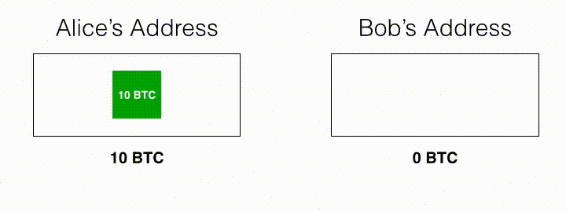

theme: Work, 1

# [fit]Intro to Blockchains &
# [fit]Cryptocurrencies
 
## [fit]CS @ Illinois SAIL 2018

---

# [fit]About me

## [fit]Andrew Yang, CS @ Illinois 2018

---
[.build-lists: true]

# [fit]What to expect from this talk

- A high-level overview of how blockchains work
- How to buy Bitcoin, Ethereum, and other cryptocurrencies
- How to store your Bitcoin, Ethereum, etc.
- Good resources to learn more about cryptocurrencies

---

          
# [fit]What is a blockchain?

---

# [fit]What is a blockchain?

A digital, distributed ledger in which transactions are publicly recorded.

Invented by Satoshi Nakamoto for use in Bitcoin.

---
[.build-lists: true]

# [fit]Properties of the blockchain

- *Replicated & decentralized*: Every full node has a copy of the blockchain, and there's no central authority
- *Trustless & verifiable*: Don't have to trust other nodes, any computer with the necessary software can verify the correctness of the blockchain
- *Censorship-resistant*: Bad actors cannot prevent valid transactions from being processed
- *Irreversible*: Transactions are irreversible except under very specific conditions

---
[.build-lists: true]

# [fit]Structure of a blockchain

- A blockchain consists of a series of *blocks*.
- Each block consists of a series of *transactions*, a hash of the previous block header, and a nonce.

---

Simplified illustration of a blockchain

---
[.build-lists: true]

# [fit]What is inside a transaction?

A transaction consists of:

- Set of inputs
- Set of outputs
- Version number (for backwards compatibility when verifying the blockchain)

---

# [fit]What are inputs and outputs?

In Bitcoin and other cryptocurrencies, each transaction transform a set of discrete inputs into a set of discrete outputs using crypographic methods.

The set of inputs contain a set of previously unspent transaction outputs.

The set of outputs consists of newly created *unspent transaction outputs* (UTXOs).

---

# [fit]What are inputs and outputs?

Each output has a value in *satoshis*, the smallest divisible unit of currency in the Bitcoin blockchain.

**1 Bitcoin == 100,000,000 satoshis**

Each address can own a set of UTXOs. The sum of these UTXOs' values is the address' "balance"—the number of satoshis this address has the right to spend.

---

# [fit]What about change?

Suppose Alice wants to send Bob exactly 5 BTC. However, Alice currently has only one UTXO worth 10 BTC. How can Alice send **exactly** the correct amount?

---

# [fit]What about change?

*The input is split into two UTXOs.* One of them is refunded back to Alice.

Therefore, transaction outputs are either unspent or spent. They **cannot** be partially spent.

In practice, the sum of what Alice is refunded and what Bob receives will be *slightly less than* 10 BTC... *Because of transaction fees!*

---

Credit: https://bitzuma.com/posts/five-ways-to-lose-money-with-bitcoin-change-addresses/

---

# [fit]How is the blockchain secured?

The blockchain is secured with the proof of work (PoW) consensus algorithm.

Also used in Ethereum, Litecoin, ZCash, Monero, and other cryptocurrencies!

---

# [fit]What is proof of work?

In order to *mine* a block, you have to collect transactions and find a block nonce via brute-force such that *the hash of the block starts with a certain number of zeros*.

The number of zeros required is the mining difficulty. It is self-adjusting so that *the average block time is 10 minutes*.

---

# [fit]What is proof of work?

When a miner successfully finds a nonce that meets the hash requirement, it will broadcast the next block's header and a *coinbase transaction*. (Not to be confused with Coinbase.com)

The first transaction in any block is the coinbase transaction. Through this, the miner claims the *block reward* plus transaction fees from the previous block.

---

# [fit]Block rewards

The block reward was *initially 50 BTC*.[^1]

The block reward halves every 210,000 blocks. Therefore, the maximum number Bitcoins that can ever exist is *21,000,000*.

Currently, the block reward is *12.5 BTC*. The next reward halving is expected to happen on May 31, 2020.

[^1]: http://www.bitcoinblockhalf.com/

---

# [fit]What happens to unprocessed transactions?

Transactions that don't immediately become a part of the next block are stored in the miner's *mempool*.

Many miners will select transactions with the highest transaction fees first.

---

# [fit]Drawbacks to proof of work

- *Environmentally unfriendly*: Bitcoin miners consume over 160 million KWh of electricity daily—enough to power over 5.4 million US households for a day![^1]
- *Undemocratic*: The best application-specific integrated circuits (ASICs) outperform the best GPUs by a factor of 1000. ASICs can cost over $2000 each![^2]

[^1]: https://digiconomist.net/bitcoin-energy-consumption

[^2]: https://en.bitcoin.it/wiki/Mining\_hardware\_comparison

---

        
# [fit]So what are some alternative
# [fit]consensus algorithms?

---

# [fit]Alternative consensus mechanisms

- Proof of stake (PoS)
- Delegated proof of stake (DPoS)
- Byzantine fault tolerance (BFT)

---

# [fit]What is Ethereum?

---

# [fit]How do I access my cryptocurrency?
