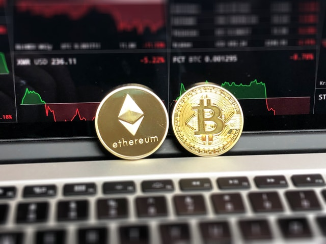
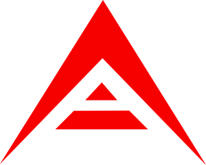
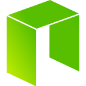
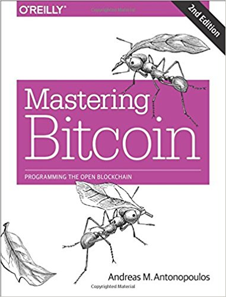

theme: Work, 1



# [fit]Intro to Blockchains &
# [fit]Cryptocurrencies
<br/>
## [fit]CS @ Illinois SAIL 2018

---

# [fit]About me


## [fit]Andrew Yang, CS @ Illinois 2018

---
[.build-lists: true]

# [fit]What to expect from this talk

- A high-level overview of how blockchains work
- How to store your Bitcoin, Ethereum, etc.
- How to buy Bitcoin, Ethereum, and other cryptocurrencies
- Good resources to learn more about cryptocurrencies

---

# [fit]Before we begin...

**This talk is purely for informational purposes—and is *not* financial advice!**

**All investments, especially cryptocurrency "investments", are subject to market risk!**

**You are *never* guaranteed a return/profit on any investment over any period of time!**

---

<br/><br/><br/><br/><br/><br/><br/><br/><br/><br/>
# [fit]What is a blockchain?

---

# [fit]What is a blockchain?

A digital, distributed ledger in which transactions are publicly recorded.

Blockchains are usually secured by *cryptographic hash functions*.

Invented by *Satoshi Nakamoto* (true identity unknown) for use in Bitcoin.

---
[.build-lists: true]

# [fit]Properties of the blockchain

- *Replicated & decentralized*: Every full node has a copy of the blockchain, and there's no central authority.
- *Trustless & verifiable*: Don't have to trust other nodes, any computer with the necessary software can verify the correctness of the blockchain.
- *Censorship-resistant*: Bad actors cannot prevent valid transactions from being processed.
- *Irreversible*: Once recorded in the blockchain, transactions are (usually) permanent and immutable.

---
[.build-lists: true]

# [fit]Structure of a blockchain

- A blockchain consists of a series of *blocks*.
- Each block consists of a series of *transactions*, a hash of the previous block header, and a nonce.
- The hash of each block must fulfill certain criteria. We will go more into detail later.

---


Simplified illustration of a blockchain

---

# [fit]What is a hash function?

A hash function maps data of arbitrary size to data of fixed size.

The output of a hash function looks random, but is actually deterministic.

```
SHA256("Facebook") ==
d41f5b4977ee05c6b61b3b5f054784628f5cd1cbe06a82a5484d1e6de6eefe85

SHA256("facebook") ==
3d59f7548e1af2151b64135003ce63c0a484c26b9b8b166a7b1c1805ec34b00a
```

---

# [fit]What is a hash function?

A *cryptographic hash function* must also be infeasible to invert.

If `x` and `y` are arbitrary inputs and `h` is a hash function, it should be infeasible to find `h(x) == h(y)` where `x ≠ y`.

Bitcoin uses a *cryptographic hash function* called *SHA-256*.

---
[.build-lists: true]

# [fit]What is inside a transaction?

A transaction consists of:

- Set of inputs
- Set of outputs
- Version number (for backwards compatibility when verifying the blockchain)

---

# [fit]What are inputs and outputs?

In Bitcoin and other cryptocurrencies, each transaction transform a set of discrete inputs into a set of discrete outputs using crypographic methods.

The set of inputs contain a set of previously unspent transaction outputs.

The set of outputs consists of newly created *unspent transaction outputs* (UTXOs).

---

# [fit]What are inputs and outputs?

Each output has a value in *satoshis*, the smallest divisible unit of currency in the Bitcoin blockchain.

**1 Bitcoin == 100,000,000 satoshis**

Each address can own a set of UTXOs. The sum of these UTXOs' values is the address' "balance"—the number of satoshis this address has the right to spend.

---

# [fit]How is change handled?

Suppose Alice wants to send Bob exactly 5 BTC. However, Alice currently has only one UTXO worth 10 BTC. How can Alice send **exactly** the correct amount?

---

# [fit]How is change handled?

*The input is split into two UTXOs.* One of them is refunded back to Alice.

Therefore, transaction outputs are either unspent or spent. They **cannot** be partially spent.

In practice, the sum of what Alice is refunded and what Bob receives will be *slightly less than* 10 BTC... *Because of transaction fees!*

---


Credit: https://bitzuma.com/posts/five-ways-to-lose-money-with-bitcoin-change-addresses/

---

# [fit]How is the blockchain secured?

The blockchain is secured with the *proof of work* (PoW) consensus algorithm.

Also used in Ethereum, Litecoin, ZCash, Monero, and other cryptocurrencies!


---

# [fit]What is proof of work?

In order to *mine* a block, miners have to collect transactions and find a block nonce (an arbitrary integer) via brute-force such that *the hash of the block starts with a certain number of zeros*.

The number of zeros required is the mining difficulty. It is self-adjusting so that *the average block time is 10 minutes*.

---

# [fit]What is proof of work?

When a miner successfully finds a nonce that meets the hash requirement, it will broadcast the next block's header and a *coinbase transaction*. (Not to be confused with Coinbase.com)

The first transaction in any block is the coinbase transaction. Through this, the miner claims the *block reward* plus transaction fees from the previous block.

---

# [fit]What is a block reward?

The block reward was *initially 50 BTC*.[^1]

The block reward halves every 210,000 blocks. Therefore, the maximum number Bitcoins that can ever exist is *21,000,000*.

Currently, the block reward is *12.5 BTC*. The next reward halving is expected to happen on May 31, 2020.

[^1]: http://www.bitcoinblockhalf.com/

---

# [fit]What happens to unprocessed transactions?

Transactions that don't immediately become a part of the next block are stored in the miner's *mempool*.

Many miners will select transactions with the highest transaction fees first.

In the Bitcoin network, the transaction fee is approximately 0.00013 BTC (or $1) as of April 2018.[^2]

[^2]: https://bitinfocharts.com/comparison/bitcoin-transactionfees.html

---

<br/><br/><br/><br/><br/><br/>
# [fit]How can bad actors
# [fit]attack the blockchain?

---

# [fit]Double spending

Remember that transactions must consume UTXOs. The same output cannot be spent twice!

However, a bad actor could get lucky and guess the nonce quickly. This is unlikely to happen multiple times in a row, though.

Best practice is to *wait for at least one block confirmation* before spending your Bitcoin. Exchanges wait for at least six confirmations.

---

# [fit]51% (majority) attack

A 51% attack occurs when a bad actor controls the majority of the network's hashrate. If that happens, the bad actor is likely to be able to control the blockchain.

With major cryptocurrencies like Bitcoin, **this is not a problem!**

The hashrates are just too high, and any bad actors would be better off financially if they used their hashrate to mine.

---

# [fit]Altering past blocks

A bad actor would need to have *far more hashrate than the entire network combined!*

A bad actor would have to "redo" the work in finding nonces for spoofed blocks and would never catch up to the rest of the network!

This is why the blockchain can be considered irreversible.

---

<br/><br/><br/><br/><br/><br/>
# [fit]Sounds great!
# [fit]What are the drawbacks?

---
[.build-lists: true]

# [fit]Drawbacks to proof of work

- *Environmentally unfriendly*: Bitcoin miners consume over 160 million KWh of electricity daily—enough to power over 5.4 million US households for a day![^3]
- *Undemocratic*: The best application-specific integrated circuits (ASICs) outperform the best GPUs by a factor of 1000. ASICs can cost over $2000 each![^4]

[^3]: https://digiconomist.net/bitcoin-energy-consumption

[^4]: https://en.bitcoin.it/wiki/Mining\_hardware\_comparison

---

<br/><br/><br/><br/><br/><br/><br/><br/>
# [fit]So what are some alternative
# [fit]consensus algorithms?

---
[.build-lists: true]

# [fit]Alternative consensus mechanisms[^5]

- Proof of stake (PoS)
- Delegated proof of stake (DPoS)
- Byzantine fault tolerance (BFT)

[^5]: https://hackernoon.com/an-overview-of-cryptocurrency-consensus-algorithms-9d744289378f

---
[.build-lists: true]

# [fit]Proof of stake consensus

- Instead of mining, the network requires participants to *stake a portion of their coins* to verify transactions.
- For each block, a "minter" is usually selected *in proportion to how much they staked*.
- Bad behavior is punished by having the bad actor's stake taken away.
- Not yet proven effective on a major cryptocurrency, although Ethereum is planning on using PoS in its Casper update.

---
[.build-lists: true]

# [fit]Attacks on proof of stake

- *Sybil attack*: A bad actor forges many identities to try to gain control of the network. If the chance of being selected as the "minter" is proportional to the amount staked, this is **not possible**.
- *51% attack*: A bad actor must buy a majority of the supply to carry out this attack. Depending on the market cap of the cryptocurrency, this could be **extremely difficult**.

---
[.build-lists: true]

# [fit]Delegated proof of stake

- Participants *vote* for a set of delegates to serve the role of validating transactions.
- Each participant's vote is proportional to the amount in their wallets. The more votes a delegate has, the higher chance they will be selected to mint a block.
- Used in Lisk and Ark.



---
[.build-lists: true]

# [fit]PoS versus DPoS

- **PoS is to direct democracy as DPoS is to representative democracy.**
- DPoS tends to be more centralized than PoS, but it's also *more scalable*.

---

# [fit]Byzantine fault tolerance

- Each validator manages the state of the blockchain and share messages between each other to arrive at a correct transaction record.
- Can be *extremely scalable* if done correctly, but can also be *extremely centralized*.
- Used in NEO, Ripple, and Stellar.



---

<br/><br/><br/><br/><br/><br/><br/><br/><br/><br/>
# [fit]What is Ethereum?

---

# [fit]What is Ethereum?

Ethereum is a blockchain-based distributed computing platform. The name of the cryptocurrency on the Ethereum platform is *ether*.

The platform provides a Turing-complete virtual machine to run *smart contracts*.

It was invented by a team led by *Vitalik Buterin* in 2014.

---

# [fit]What are smart contracts?

Smart contracts are scripts that move assets around based on coded logic.

Their source codes are accessible to anyone with access to the Ethereum blockchain.

Smart contracts can be used to back insurance policies, claim assets, crowdfund projects (ICOs), among other use cases.

---

# [fit]How are transaction fees handled in Ethereum?

The more computations a smart contract requires, the more *gas* it uses. Gas prices are expressed in *Gwei* where **1 ether == 10^9 Gwei**.
Gas prices typically range from 1 Gwei up to 50 Gwei.

A typical transaction costs 21000 gas. Suppose you set the gas price to 5 Gwei. Then, the transaction fee would cost 0.000105 ether—or about $0.04.

Interacting with smart contracts consumes more gas than simple transactions of ether.

---

# [fit]What are ERC-20 tokens?

ERC-20 is an Ethereum token standard for smart contracts.

The ERC-20 standard defines a *common interface*—a common set of functions that any ERC-20 compliant contract must implement.

Anyone interacting with ERC-20 compliant contracts won't have to write custom code for each contract.

---

<br/><br/><br/><br/><br/><br/><br/><br/>
# [fit]What are public
# [fit]and private keys?

---

# [fit]What are public and private keys?

A public key identifies your wallet—anyone with access to the blockchain can view your activity.

A private key grants the holder the rights to spend the cryptocurrency.

If you lose your private key, **you lose access to your money!**

If someone else knows your private key, **your money will be stolen!**

---

# [fit]Public key vs. public address

A public key can derive many public addresses.

Wallets with support for hierarchical deterministic wallets described in the *BIP-32 standard* support this feature.

Reusing public addresses can compromise your privacy.

---


---

<br/><br/><br/><br/><br/><br/><br/><br/>
# [fit]How do I store & access
# [fit]my cryptocurrency?

---

# [fit]How do I store & access my cryptocurrency?

You can access your cryptocurrency through a *wallet*, which stores your private seed and keys.

The term "wallet" is a misnomer—your wallet doesn't store actual cryptocurrency.
**Think of a cryptocurrency wallet as a keychain that holds your private and public keys.**

All wallets are either *cold* (offline) or *hot* (connected to the Internet).
Cold wallets are more secure than hot wallets.

---
[.build-lists: true]

# [fit]What are the different types of wallets?

- *Web wallet*: Webapps. Check to make sure you own your private keys, and use 2FA!
- *Desktop wallet*: Downloaded and used on laptops and PCs. Easy to access and can be used offline.
- *Mobile wallet*: Downloaded and used as a smartphone app. Watch out for scams!
- *Paper/physical wallet*: Private and public keys are printed or engraved.
- *Hardware wallet*: Small, portable devices that store your private keys. These keys never leave your device!

---

# [fit]If you own "a lot" of cryptocurrencies,
# [fit]you should use a hardware wallet!

I recommend the **Ledger Nano S**.

Buy one here (affiliate link):
[https://www.ledgerwallet.com/r/f5ed?path=/products/ledger-nano-s](https://www.ledgerwallet.com/r/f5ed?path=/products/ledger-nano-s)

---

# [fit]How can I access my Ethereum tokens?

The most popular option is *MyEtherWallet.com*. It is a web interface that is *compatible with hardware wallets* like the Ledger Nano S.

Another popular option is *Metamask*. It is available as an extension for the Chrome, Firefox, and Opera browsers.


---

# [fit]How can I backup my wallet?

When you first use a web wallet, software wallet, or hardware wallet, it may ask you to write down a mnemonic series of words. **Do that immediately and store it in a secure place!**

If you lose access to your wallet, you can restore it with this series of words.
Using the *BIP-39 standard*, you can use your backup words to derive your seed, which in turn can derive your private keys for all your cryptocurrencies.

---

<br/><br/><br/><br/><br/><br/><br/><br/><br/><br/>
# [fit]How do I buy cryptocurrencies?

---
[.build-lists: true]

# [fit]How do I buy cryptocurrencies?

You can buy cryptocurrencies like Bitcoin and Ethereum on *exchanges*.

There are three types of exchanges...

---

# [fit]Fiat-to-crypto exchanges

These exchanges allow you to deposit or withdraw US dollars, euros, or other fiat currencies, and exchange them for cryptocurrencies.

Usually you can also deposit or withdraw cryptocurrencies, too.

Examples include Coinbase/GDAX, Gemini, Poloniex, and Kraken.

---

# [fit]Crypto-to-crypto exchanges

These exchanges allow you to deposit, withdraw, and trade only cryptocurrencies. This is usually to avoid regulations associated with handling fiat currencies.

Examples include Binance, Bittrex, and Kucoin.

---

# [fit]Coin swap services


These services allow you to exchange cryptocurrencies anonymously. The only information you have to give is a public address and a refund address.

Unlike the other two types of exchanges, coin swap services never hold your cryptocurrencies. Thus, they are *non-custodial*.

Examples include Shapeshift.io, Changelly, and ChangeNow.io.

---

<br/><br/><br/><br/><br/><br/><br/><br/>
# [fit]Do not keep a significant amount
# [fit]of money on any exchange!

---

> **If you control the keys, it’s your Bitcoin. If you don’t control the keys, it’s not your Bitcoin.**
-- Andreas Antonopoulos

---

<br/><br/><br/><br/><br/>
# [fit]I am overwhelmed...
# [fit]Where can I learn more
# [fit]about cryptocurrencies?

---

# [fit]Mastering Bitcoin by Andreas Antonopoulos

Read for free: [https://github.com/bitcoinbook/bitcoinbook](https://github.com/bitcoinbook/bitcoinbook)



---

# [fit]Online resources for learning

- [Andreas Antonopoulos on YouTube](https://www.youtube.com/channel/UCJWCJCWOxBYSi5DhCieLOLQ)
- [Jackson Palmer on YouTube](https://www.youtube.com/channel/UCTOzxu_HvuJfZtTJ6AZ7rkA)
- [Crypto Tips on YouTube](https://www.youtube.com/channel/UCavTvSwEoRABvnPtLg0e6LQ)
- [Unchained podcast](http://unchainedpodcast.co/)
- [/r/CryptoTechnology](https://www.reddit.com/r/CryptoTechnology/)
- [Lots of articles on Medium tagged "cryptocurrency"](https://medium.com/tag/cryptocurrency)

---

# [fit]Online resources for news

- [Doug Polk on YouTube](https://www.youtube.com/channel/UC4sS8q8E5ayyghbhiPon4uw)
- [Ivan on Tech on YouTube](https://www.youtube.com/user/LiljeqvistIvan)
- [Boxmining on YouTube](https://www.youtube.com/channel/UCxODjeUwZHk3p-7TU-IsDOA)
- [David Hay on YouTube](https://www.youtube.com/user/DavidHaydotOrg)
- [Crypto Bobby on YouTube](https://www.youtube.com/channel/UCt_oM56Ui0BCCgi0Yc-Wh3Q)
- [The Merkle](https://themerkle.com/)
- [Coincentral](https://coincentral.com/)
- [Coin Talk podcast](https://player.fm/series/coin-talk)

---


<br/><br/><br/><br/><br/><br/><br/><br/>
# [fit]Follow notable people on Twitter who
# [fit]are involved in cryptocurrencies!

---

# [fit]Notable crypto people on Twitter


- **Andreas Antonopoulos** [@aantonop](https://twitter.com/aantonop): blockchain and Bitcoin evangelist
- **Naval Ravikant** [@naval](https://twitter.com/naval): blockchain evangelist
- **Vitalik Buterin** [@VitalikButerin](https://twitter.com/VitalikButerin): Ethereum co-creator
- **Joseph Lubin** [@ethereumJoseph](https://twitter.com/ethereumJoseph): Ethereum co-creator and ConsenSys founder
- **Charlie Lee** [@satoshilite](https://twitter.com/satoshilite): Litecoin creator
- **Charles Hoskinson** [@IOHK_Charles](https://twitter.com/IOHK_Charles): Cardano creator
- **Riccardo Spagni** [@fluffypony](https://twitter.com/fluffypony): Monero lead developer

---

# [fit]Additional resources & affiliate links

- Sign up for Coinbase:
[https://www.coinbase.com/join/5ac1c3130379bf01ddb0e376](https://www.coinbase.com/join/5ac1c3130379bf01ddb0e376)
- Sign up for Binance:
[https://www.binance.com/?ref=17651721](https://www.binance.com/?ref=17651721)

---

# [fit]Additional resources & affiliate links

- Swap coins with ChangeNow.io:
[https://changenow.io?link_id=51f14cfa38ee10](https://changenow.io?link_id=51f14cfa38ee10)
- Buy the Ledger Nano S hardware wallet:
[https://www.ledgerwallet.com/r/f5ed?path=/products/ledger-nano-s](https://www.ledgerwallet.com/r/f5ed?path=/products/ledger-nano-s)

---

# [fit]And finally...


I write about cryptocurrencies, among other topics.
Follow me at *[blog.andrewyang.xyz](https://blog.andrewyang.xyz/)*
